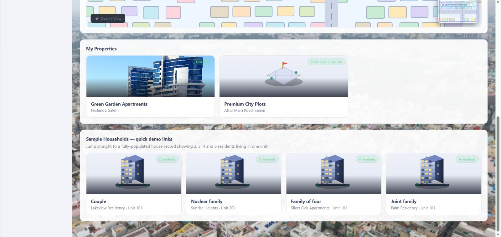
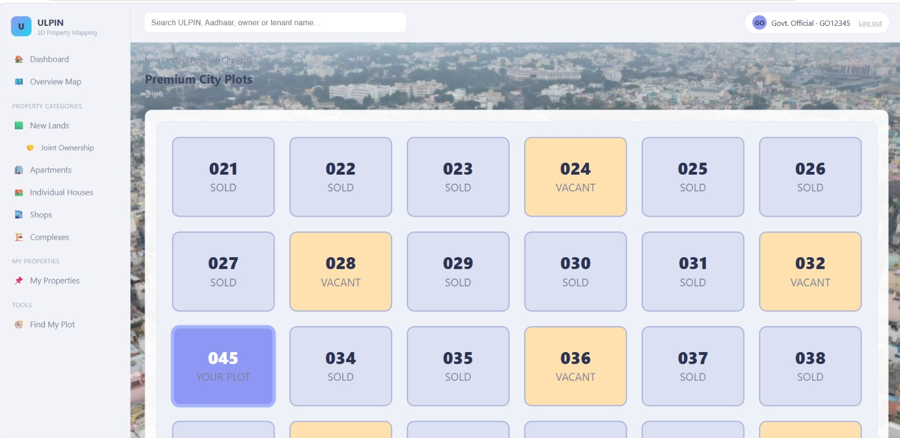
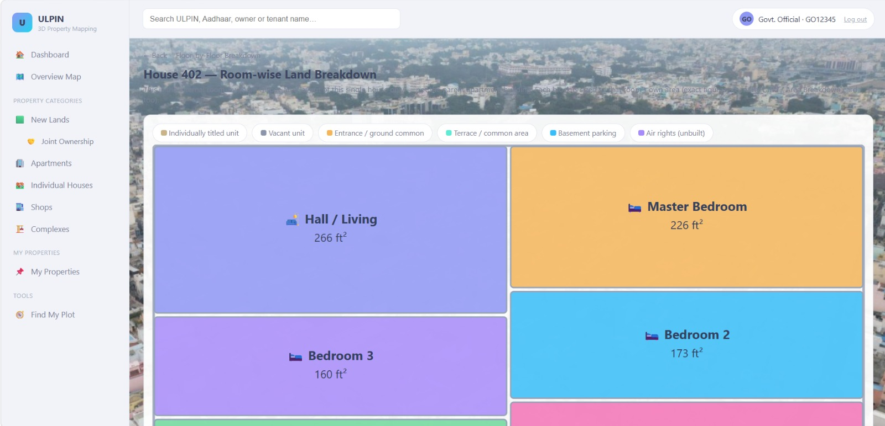
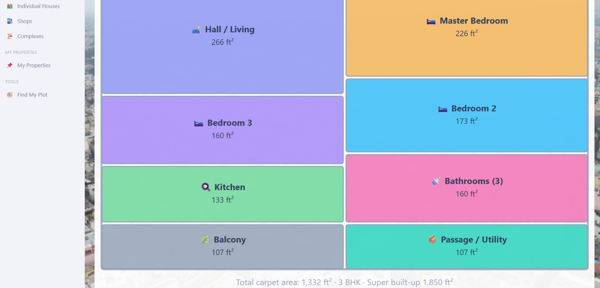

# Application Screenshots

This directory catalogs all interface views and workflow stages of the **ULPIN 3D** application.

---

### 1. Login Authentication

---

### 2. Main Dashboards
* **Primary Dashboard:** 
* **Secondary Dashboard:** 

---

### 3. Overview Maps
* **Overview 1:** 
* **Overview 2:** 

---

### 4. Land Breakdown Views
* **View 1:** 
* **View 2:** 
* **View 3:** 
* **View 4:** 
* **View 5:** 

---

### 5. Room Breakdown Views
* **Room View 1:** 
* **Room View 2:** 

---

# Application Screenshots

This directory catalogs all interface views and workflow stages of the **ULPIN 3D** application.

---

### 1. Login Authentication

---

### 2. Main Dashboards
* **Primary Dashboard:** 
* **Secondary Dashboard:** 

---

### 3. Overview Maps
* **Overview 1:** 
* **Overview 2:** 

---

### 4. Land Breakdown Views
* **View 1:** 
* **View 2:** 
* **View 3:** 
* **View 4:** 
* **View 5:** 

---

### 5. Room Breakdown Views
* **Room View 1:** 
* **Room View 2:** 

---

