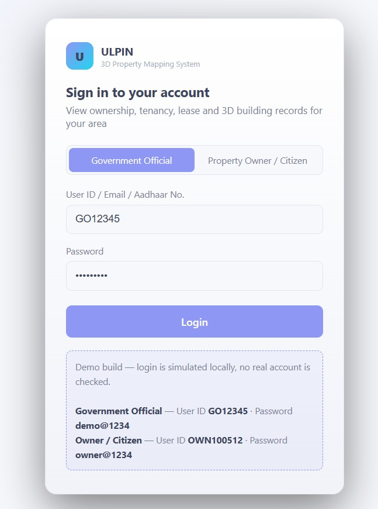
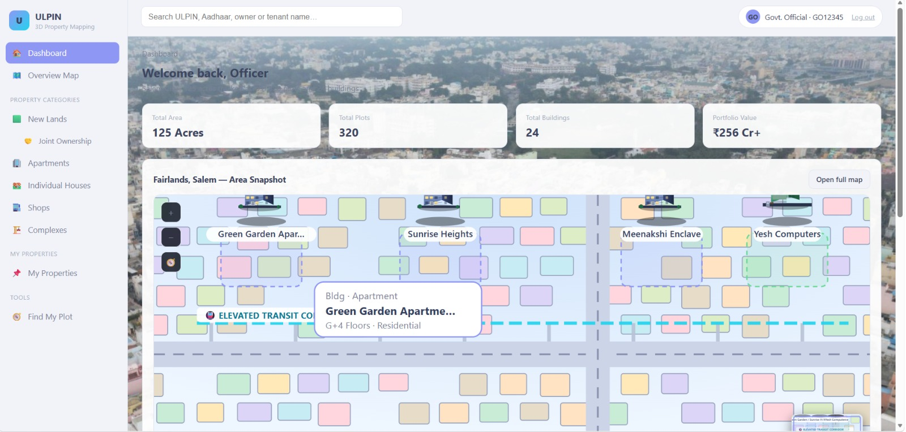
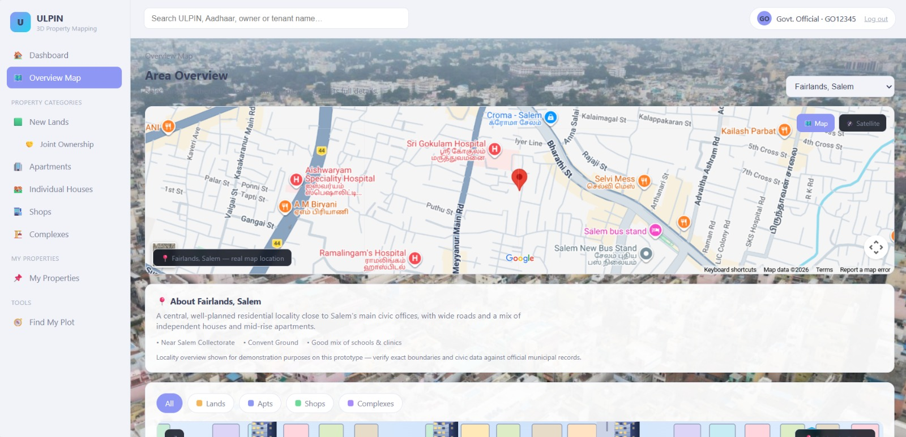
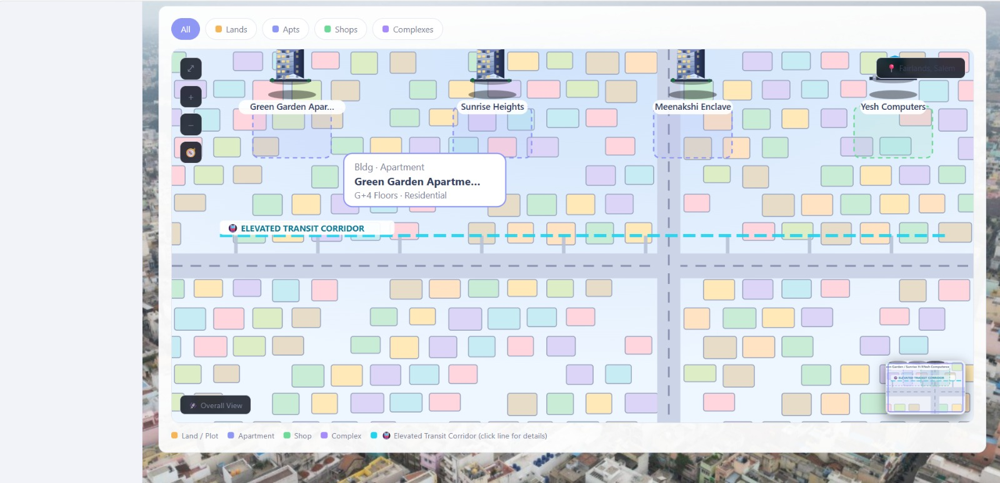
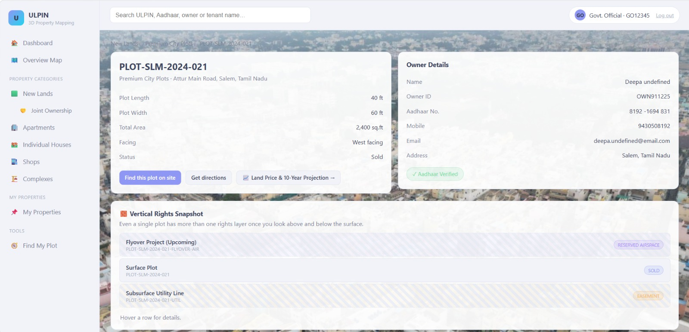
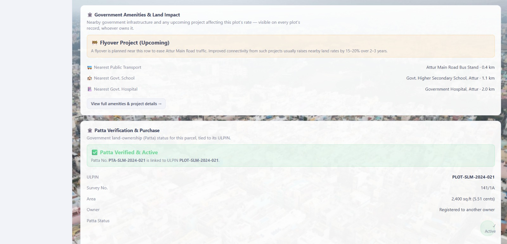
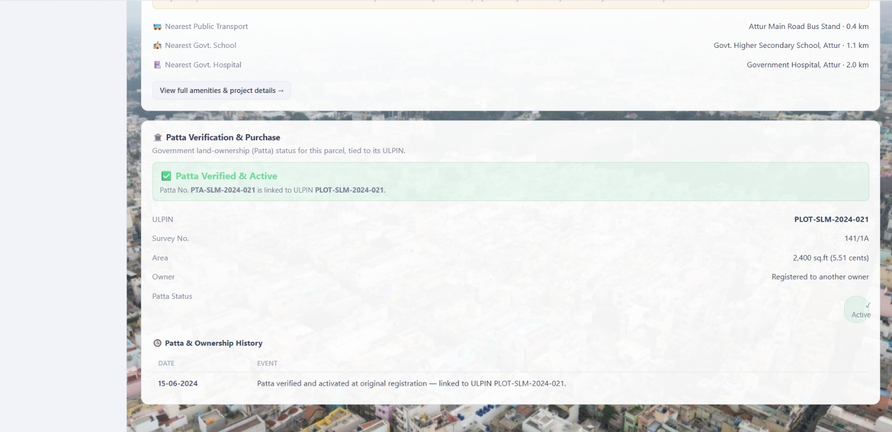
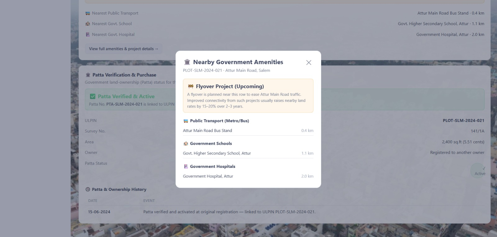

# Application Screenshots

This directory catalogs all interface views and workflow stages of the **ULPIN 3D** application.

---

### 1. Login Authentication

*Secure login portal for land administration authorities.*

---

### 2. Main Dashboards
**Primary Dashboard View:**

*Overview showing active spatial metrics and system modules.*

**Secondary Dashboard View:**

*Alternative dashboard layout tracking property layers.*

---

### 3. Overview Maps
**Overview Map 1:**

*Geo-referenced map layer displaying cadastral parcel boundaries.*

**Overview Map 2:**

*Detailed spatial overview with elevation layers.*

---

### 4. Land Breakdown Views
*The system provides multi-tiered hierarchical breakdowns from parcel footprints down to individual property units:*

* **View 1:** 
* **View 2:** 
* **View 3:** 
* **View 4:** 
* **View 5:** 
*
